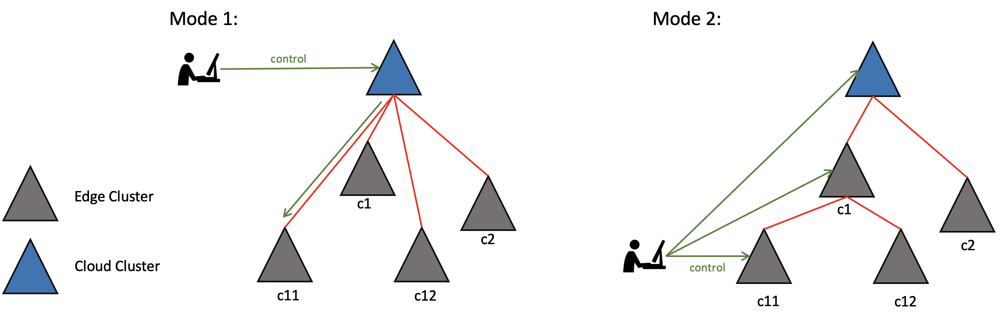
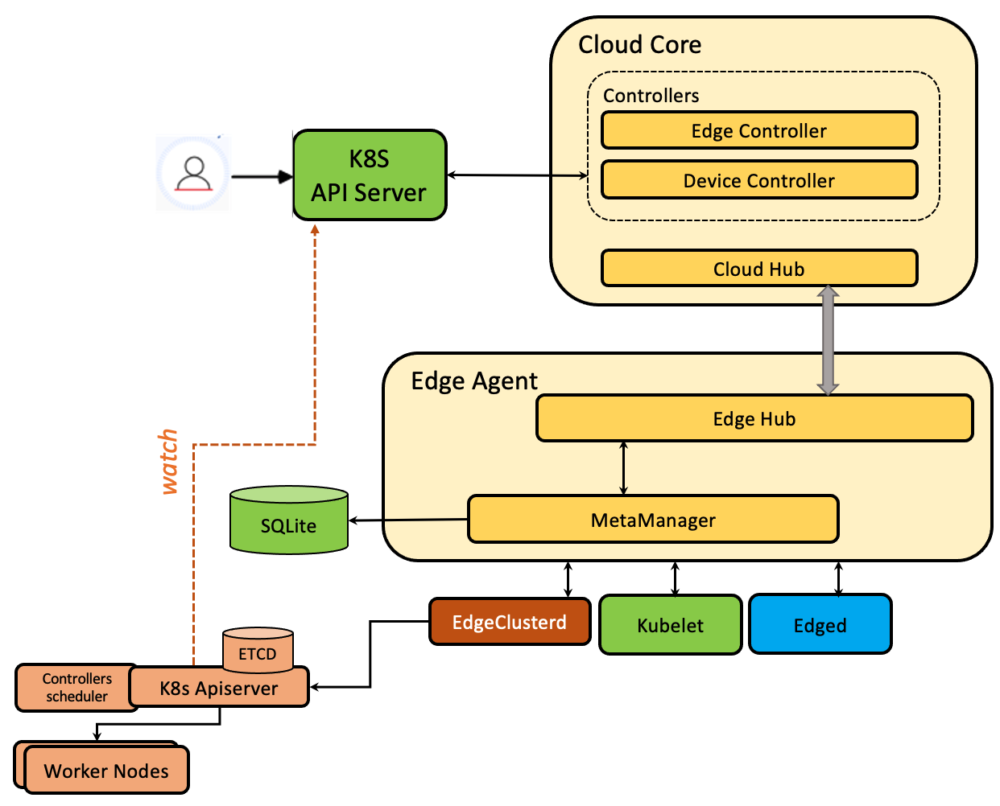
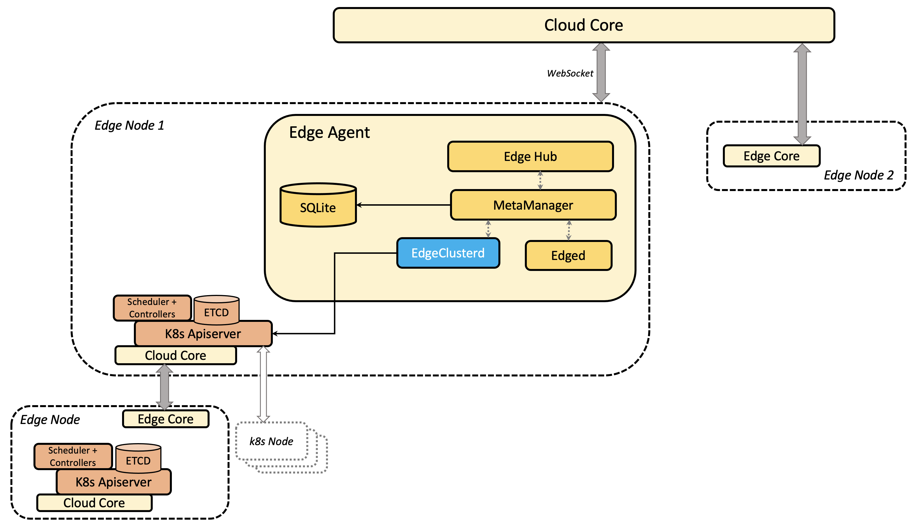
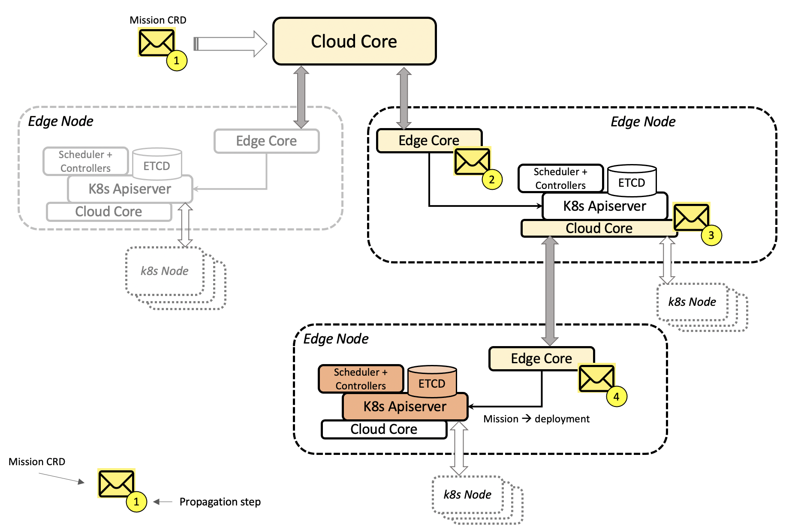
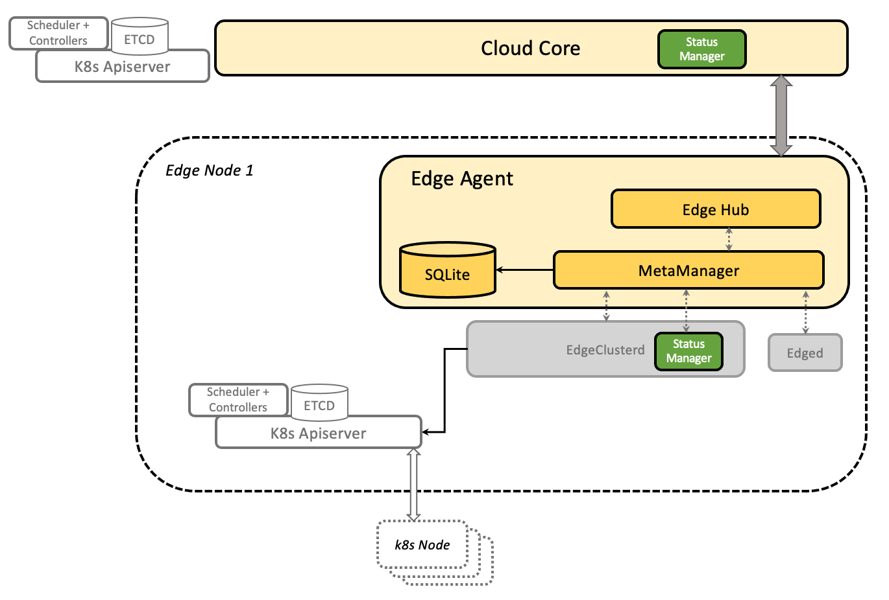
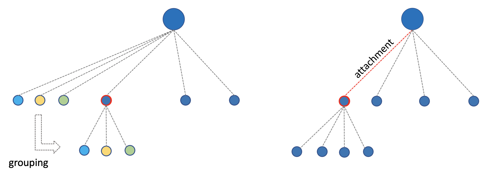
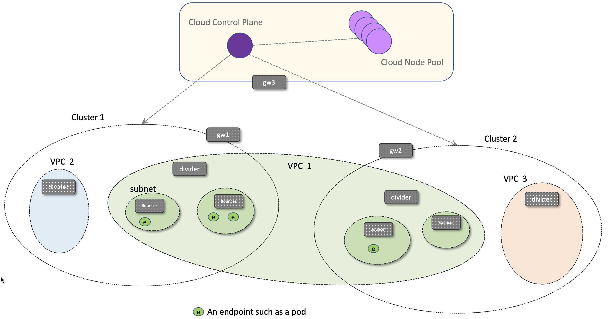

# Centaurus Edge Design

## Abstract
The prosperity of cloud technologies, 5G and AI brings vast opportunities for edge computing where computation migrates from centralized data centers to on-prem, at-home, and remote areas. This document introduces a novel edge-computing framework design for Centaurus. Observing and honoring the requirements specific to edge environments, e.g. low latency, high survivability, and hierarchically distributed architecture, this design features 
1. unning clusters on the edge, alongside with edge nodes,
2. Flexible topologies where edge clusters are connected in a multi-layer tree-like structure,
3. Flexible flavored clusters on the edge, such as Arktos, K8s and K3s, 
4. Direct inter-cluster communication without going through the central cloud, and, 
5. Smart edge cluster formation. 

## Scenarios

- IoT, where devices such as temperature sensors and surveillance cameras are connected to edge nodes.
- Smart Factory, where cluster of nodes run on the edge site.
- Multi-access edge computing (MEC), where edge applications run on edge nodes or clusters places in or close to the cellular network.

## Requirements 

Edge computing environments have the following key differences comparing to the cloud environments:

- Low computing power
- Low energy suply and consumption
- Unstable network connection
- Smaller or no dev-ops teams
- Complex topology

## Design Principles

### Robustness

Centaurus edge addresses the requirements by allowing workloads on the edge to continue functioning with tolerance to the following conditions: 

1. Network disconnect
2. Edge node failure
3. Both 1. and 2. happen Simultaneously 

Altogether, meeting the three requirements would allow applications to run on the edge with the best effort against environment fluctuation and node failures.

### Flexible Topology

In addition, observing that edge environments could have multiple layers and hierarchies following either locality or logical distribution, Centaurus edge is designed to allow hierarchical construction of edge cluster topology for flexible configurability.

## Existing Solutions

### IoT

These solutions provide functions to manage computing nodes running on the edge environments. The control plane sits in the cloud, and an "agent" type of software components is deployed on the edges node to allow edge nodes to continue running when the network disconnects. The existing solutions includes:

- [KubeEdge](https://github.com/kubeedge/kubeedge)
- [OpenYurt](https://github.com/openyurtio/openyurt)
- [SuperEdge](https://github.com/superedge/superedge)
- [BAETYL](https://github.com/baetyl/baetyl)
- [Virtual Kubelet](https://virtual-kubelet.io/)

These solutions meet condition 1 of the design principles.  

### Edge Cluster 

These solutions have the control plane including apiserver, controllers and scheduler in the edge sites. The existing solutions includes:

- [Kubefed](https://github.com/kubernetes-sigs/kubefed)
- [Karmada](https://github.com/karmada-io/karmada)
- [TKEStack](https://github.com/tkestack/tke)
- [Cluster-registry](https://github.com/kubernetes-retired/cluster-registry), retired
- [Namespace Sameness](https://github.com/kubernetes/community/blob/master/sig-multicluster/namespace-sameness-position-statement.md)

These solutions meet condition 2 of the design principles.

## Models

The Centaurus Edge architecture is modeled as an [m-ary tree](https://en.wikipedia.org/wiki/M-ary_tree) where an [Arktos](https://github.com/CentaurusInfra/arktos) control plane sits at the root of the tree in the cloud, and leaf tree nodes represent computing nodes on the edge. The sub-trees in the m-ary tree are standalone clusters, and the roots of the sub-trees are control planes for edge clusters. As usual with Arktos clusters, there are also compute nodes in the cloud managed by the root level Arktos control plane.

The following graph is an example of such an edge model.


The m-ary tree model satisfies all four previously mentioned requirements. Each edge node is deployed with an "edge agent" component that maintains connection with the control plane, runs Arktos workload, and cache messages from and to the control plane. It's worth noting that the "control plane" here is not necessarily the Arktos in the cloud. It refers to the control plane which the current node connects to. 

When the network disconnects, the workload continues running (condition 1). When a worker node in the edge cluster dies, its workloads could be migrated to other nodes in the same cluster (condition 2). And because the control plane operates locally with the worker nodes, condition 3 can also be achieved. 

Being a tree structure, the layered and hierarchy nature of edge site topology can be expressed with great flexibility. Depending on use cases, edge environments could have vastly different requirements and restrictions. The design of Centaurus edge strives to leave the choice to users by offering a flexible framework. As an example, The following graph shows two possible modes that edge clusters can be structured. Each triangle represents a cluster. Mode 1 is a "flat" structure where each edge cluster directly connects to the cloud control plane. This structure, similar to federation, could benefit the case where clusters are managed centrally from the cloud, and each cluster has network connectivity to the cloud via public internet. In comparison, in mode 2, edge clusters are locally connected in a hierarchy, and only certain edge clusters are connected to the cloud. This mode maps more closely to scenarios where multiple edge clusters are managed from within an on-prem network boundary. Local management is available even when connection to the cloud is lost whereas in mode 1, user control relies on internet connection being accessible between the cloud and edge clusters.  



Mode 1 and 2 are two extremes of the Centaurus edge model expressibility. In between are various possibilities of combination, and the choice is in the hands of users. This kind of flexibility allows edge clusters to be structured to match as close as possible to the physical or logical model of edge application.

## Key Feature Design

This section details the design of key components to implement the Centaurus edge model.

### Edge Cluster
Centaurus edge supports a variety of "K8s" flavors running as edge clusters. This includes "vanilla" K8s, [k3s](https://k3s.io/), and Arktos. The following figure details the components of an edge cluster. 



From an edge cluster's own perspective, it operates as usual by watching its etcd and managing its workload. It's not aware of itself being anything different than a K8s cluster running in the cloud.

From Centaurus's perspective, all edge nodes and clusters are connected in a cascading (or layered, hierarchical) structure with the help of the following components.

### Robust Edge Clusters
Derived from KubeEdge's Cloud Core and Cloud Edge concepts, an "Edge Agent" is installed on each edge node. This edge agent is responsible for managing communication with the upper level control plane, caching information in a local database (e.g. SQLite), and distributing messages to lower level entities on the same node. In addition to the Edged found in KubeEdge, a new controller called EdgeClusterd is introduced. While Edged relays and manages workloads on the edge node. The edge agent is what's providing robustness to edge workloads against network disconnect. The connection between Edge Hub and Cloud Hub is still implemented using WebSocket. Watch is not used because network fluctuation could cause frequent List operations which could consume large network capacity. Optionally, edge clusters could watch upper clusters if the network is reliable between them.

### Cascaded Edge Clusters 
With Cloud Core and Edge Agent as the connect mechanism, an edge cluster can be connected into a higher level cluster. To express such relationshio in K8s, a new object called EdgeCluster is introduced:

```golang
type EdgeCluster struct {
	metav1.TypeMeta `json:",inline"`
	// +optional
	metav1.ObjectMeta `json:"metadata,omitempty"`
	// Spec defines desired state of network
	// +optional
	Spec EdgeClusterSpec `json:"spec"`
	Status EdgeClusterStatus `json:"status,omitempty"`
} 
```

The EdgeCluster object is similar to the Node object in terms of the level of abstraction. An EdgeCluster object is created for each edge cluster. This new abstraction allows the expression of a group of edge clusters connected in a tree structure. Each edge cluster, just like a regular K8s cluster, maintains its pool of nodes. Furthermore, it also maintains an array of subordinate clusters that connect to it. The state of each subordinate edge clusters are stored in the EdgeClusterStatus struct:

```golang
type EdgeClusterStatus struct {
	EdgeClusters []string `json:"edgeclusters,omitempty"`	// subordinate clusters
	Healthy bool `json:"healthy,omitempty"`
	Nodes []string `json:"nodes,omitempty"`
	EdgeNodes []string `json:"edgenodes,omitempty"`
	ReceivedMissions []string `json:"receivedmissions,omitempty"`
	ActiveMissions []string `json:"activemissions,omitempty"`
	LastHeartBeat metav1.Time `json:"lastheartbeat,omitempty"`
}
```

The Cloud Core and Edge Agent bind two clusters together. In KubeEdge, Cloud Core is only deployed on the edge as the name suggests. However, it can be extended for cascading clusters on the edge too, as shown in the following figure:



In the control plane of an edge cluster, the Cloud Core component is activated to connect to its own subordinate edge nodes and edge clusters, and the EdgeCluster objects are also created in this edge clusters to represent those subordinate edge clusters.  

### Supporting Multiple K8s Flavors
Edge clusters can be running different flavors of K8s. For the EdgeClusterd to be able to communicate with a variety of K8s cluster control planes, KubeClient compatibility has to be resolved. For example, the KubeClient in Arktos has been extended to carry tenant information. Using this to watch a vanilla K8s apiserver will cause errors. Same vice versa. As a quick solution, the commandline kubectl binary can be used instead. This kubectl is provided by the subordinate cluster and therefore guarantees compatibility. More comprehensive solution would involve modifying KubeClient and this will be further investigated in later release cycles. 

### Workload Assignment
With a single edge node, workload usually refers to a single pod and virtual machine if it's supported. For a cluster, it is extended to objects such as deployment, job, statefulset, etc. In the Centaurus edge clusters, "workload" is used to refer to both cases. Because of the hierarchical nature of edge structure, workloads need to navigate to the destined nodes or clusters by traversing the tree structure, and this is called workload assignment. 

There are two implementation options for workload assignment. The first option is "invasive" to existing K8s implementation. It uses labels inside workload objects to specify the rules for targeted destinations. This method uses standard K8s object definitions, and therefore allows existing workload specifications (e.g. a yaml file for a deployment) to be used. However, controllers for the supported object types need to be changed accordingly.

The second option is less "invasive" by packing the workload object inside another object implemented by CRD. No changes are needed for existing controllers. The CRD is handled by a controller which receives, propagates, and delivers to the destined clusters. This method, however, requires creating new CRD definitions from existing workload specifications, although this could potentially be automated with the least user intervention. The following is an example of this option:

```golang
type Mission struct {
	metav1.TypeMeta `json:",inline"`
	// +optional
	metav1.ObjectMeta `json:"metadata,omitempty"`
	Spec MissionSpec `json:"spec"`
	State map[string]string `json:"state,omitempty"`
}

type MissionSpec struct {
	Content string `json:"content,omitempty"`
	Placement GenericPlacementFields `json:"placement,omitempty"`
	StateCheck StateCheckFields `json:"statecheck"`
}

type GenericClusterReference struct {
	Name string `json:"name"`
}

type GenericPlacementFields struct {
	Clusters    []GenericClusterReference `json:"clusters,omitempty"`
	MatchLabels map[string]string         `json:"matchlabels,omitempty"`
}
```

Here a CRD called "Mission" is used to store the actual workload definition (Mission/MissionSpec/Content) and destination information (Mission/MissionSpec/Placement). The following figure illustrates the flow of CRD propagation. A CRD object enveloping workload definition is created in a cluster (cloud or edge), and it is picked up by the cloud core component which watches this CRD. This CRD is in turn propagated to the edge agents based on the destination criterias defined in *Placement*. Edge agent examines the CRD, unwrap the workload specification and insert into the edge cluster if location criterias are met. In the meantime, the cloud core in the current cluster will also pick up CRD and perform propagation in the same fashion.   



In the above figures, the mission (yellow envelope) is propagated through step 1 to 4 and eventually reaches the targeted edge cluster. This method allows workload to be distributed to multiple edge clusters based on placement rules customizable by user. 

### Workload Status Reporting
The hierarchy nature of edge structure demands cluster and workload status in each layer to be relayed upward to the top level control plane. Two components are added for the status reporting, as shown in green in the following figure:



Based on the *Mission*, the status manager in EdgeClusterd periodically obtains the workload status from the subordinate cluster, and updates the *State* in the *Mission* object, which in turn is relayed to the upper level Cloud Core where the status is aggregated and updated into the etcd in that cluster's etcd. This action will trigger further updates following the same mechanism.

There are two kinds of status to be reported:

#### 1. Workload Status
The *Mission* CRD is used to carry workload information through edge cluster layers, and therefore workload information is stored as a part of the *[Mission/State]* definition called "State":

```golang
type Mission struct {
	...
	...
	State map[string]string `json:"state,omitempty"`
}
```
Each *Mission* can be deployed to multiple clusters, so the status is a collection of all workloads from the same *Mission*. The key to the *State* map is based on indivisual cluster (e.g. cluster name). 

#### 2. EdgeCluster Status
For edge cluster status, reporting is carried out in "heartbeat" fashion, similar to the node status update in "vanilla" K8s. Edge cluster status includes the health of the cluster and states of workloads running on it, defined as:

```golang
type EdgeClusterStatus struct {
	Healthy bool `json:"healthy,omitempty"`
	EdgeClusters []string `json:"edgeclusters,omitempty"`
	Nodes []string `json:"nodes,omitempty"`
	EdgeNodes []string `json:"edgenodes,omitempty"`
	ReceivedMissions []string `json:"receivedmissions,omitempty"`
	ActiveMissions []string `json:"activemissions,omitempty"`
	LastHeartBeat metav1.Time `json:"lastheartbeat,omitempty"`
}
```
Similar to the workload status, edge cluster status is also relayed to upper layers trough the hierarchy.

### Attachment vs Self-Organizing

The tree structure of the Centaurus edge allows clusters on the edge to join as a sub-tree, and this approach is called "attachment", shown in the right side of the following figure. This usually applies to the scenarios where a cluster is already provisioned and running. By "attaching" to an existing edge tree, it will be able to take workloads together with other clusters in the same tree, hence forming a co-op topology.  



In addition to "attachment", a second option is to allow Centaurus edge framework to group a set of edge nodes into a cluster based on certain criteria. For example, as shown on the left of the above figure, users have a set of edge nodes (light blue, yellow, green and darker blue). These nodes are then selected (either by user's manual inputs or automatically chosen) to be converted and grouped together into an edge cluster. This approach has multiple benefits. Firstly, users are freed from managing cluster operation, and secondly, cluster node selection can be automated based on workload resource requirement and compute resource availability. This will be further investigated in later release cycles.

### Inter-cluster Communication
For some user scenarios, such as MEC, it is beneficial if edge clusters at different locations could communicate with each other without going through the central cloud. The following figure is an example. Two pods in the same VPC 1 could be distributed into two different clusters. The goal is to allow communication between these two pods without routing through the cloud.  




This part is still undergoing research and will be updated soon.
