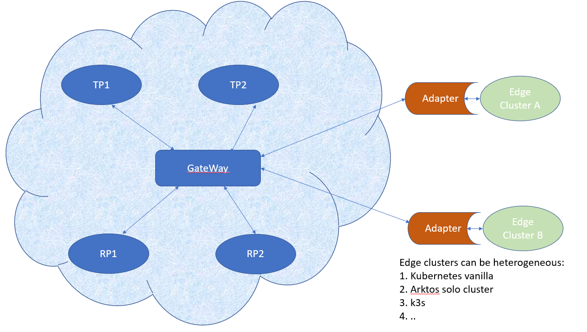

Initial Thoughts About Edge Clusters In Arktos

Artkos is a very scalable, extensible cloud compute infrastructure. It inherently supports unified orchestration of VM and container workload, and strong multi-tenancy where each user. Underlying the cover, each arktos cluster is composed of multiple partitions, where each partition can be a self-contained cluster. 

### Benefits to gain from Arktos
1.	Almost unlimited computing capability, as Arktos support a much larger number of nodes than Arktos
2.	More varieties of applications. K8S are not good at stateful applications such as DB. Yet Arktos not only support container workloads, but also VM runtimes. 
3.	Isolation and security: arktos provides strong isolation between different tenants. Note that most K8S cluster multi-tenancy projects provides soft weak mult-tenancy. 
4.	Low cost, resource sharing, etc.

###  Goal to Achieve:
1.	Flexible: can upgrade/downgrade easily between Arktos Edge-cluster and a solo edge cluster
  •	A new edge cluster can be setup and connect to the Arktos platform by just one command. 
  •	Disconnect from the Arktos can also be done in just one command
  •	To Upgrade an existing user self-running cluster to an Arktos edge cluster

### Unique Scenarios:
1.	Isolated DB services at the edge site, disconnected most of the time, yet connected to the public platform periodically for version upgrade etc. OpenYurt/SuperEdge/Kubeedge cannot do this well as K8S does not perform well in stateful apps like DB. (statefulsets are not well received).
2.	Coordinated AI training which involves multiples components. The heavy-computing and/or lower-security part can be done in the public side, while the others on the edge side. 
