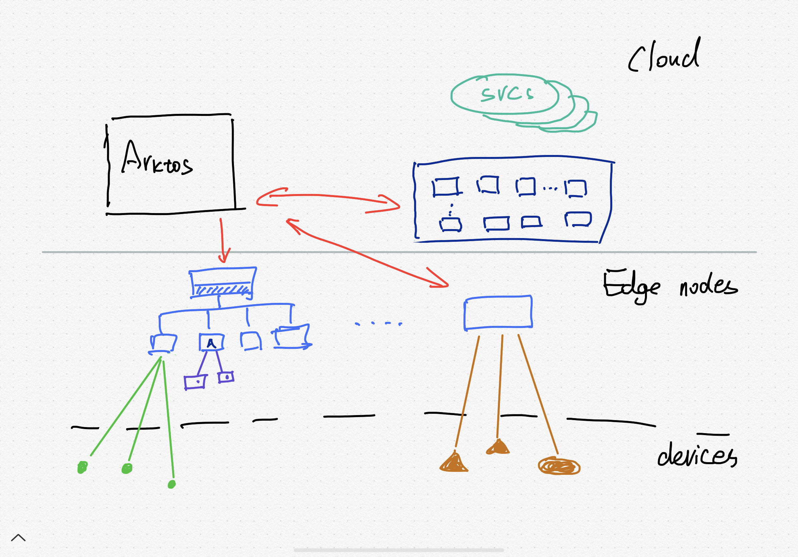

- Architecture

- Must haves:
  - cloud <-> edge tunnel/proxy
  - edge anomomy
      - edge-side apiserver/caching layer 
      - edge node and pod health check / stay alive
  - resource grouping (node group, cluster group, deploymet/service group)

- New Features
  - edge cluster management
    - scalable / "elastic" edge nodes
    - master node migration in case of power failure
    - edge cluster in same or difference network
  - heterogeneous workloads
    - container, VM, kata, etc.
  - heterogeneous nodes
    - e.g. ARM mixed with Intel

- ML & AI (for demo maybe)
  - [KubeFlow](https://www.youtube.com/watch?v=HBxyLnEzyhw)

